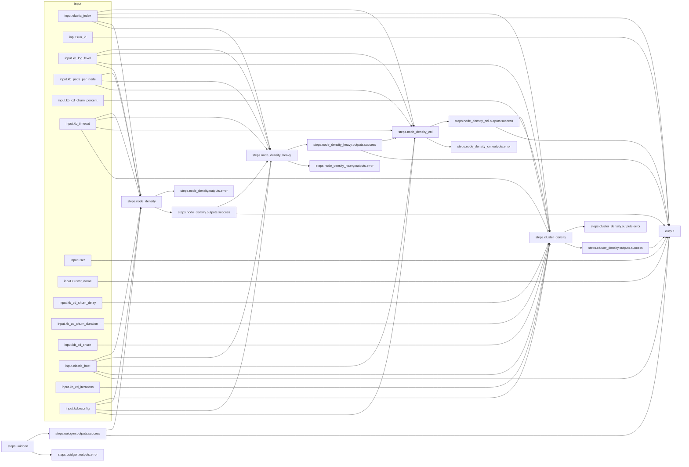

# Arcaflow kube-burner workflow

## How to run the workflow
- Download the [Arcaflow engine binary](https://github.com/arcalot/arcaflow-engine/releases) to your local system or jump host with network access to your Kubernetes/OpenShift cluster.
- Modify the [input.yaml](input-example.yaml) file to you needs (provided in this repo as `input-example.yaml` or `input-smoke.yaml`).
  - *Note: This currently requires the complete kubeconfig to be in the input file as YAML string. We will be enabling direct file input in a future enhancement. Example multi-line YAML string syntax with indentation:*
    ```yaml
    kubeconfig: |
      apiVersion: v1
      clusters:
      - cluster:
          certificate-authority-data: 
          ...
    ```

- Run the workflow (this example assumes the `arcaflow` binary is in your `$PATH` and the `workflow.yaml` file is in the local directory):
  ```bash
  $ arcaflow --input input.yaml --config config-podman.yaml
  ```

## About the workflow

This test workflow is modeled after the [Airflow CI small-control-plane-mgs DAG used here](https://github.com/cloud-bulldozer/airflow-kubernetes/blob/master/dags/openshift_nightlies/config/benchmarks/small-control-plane-mgs.json).

The workflow uses primarily iterations of our work-in-progress [kube-burner OCP wrapper](https://github.com/redhat-performance/arcaflow-plugin-kube-burner) plugin ([container image in quay.io](https://quay.io/repository/redhat-performance/arcaflow-plugin-kube-burner?tab=tags). The default kube-burner parameters are set in the [workflow.yaml](workflow.yaml) file to match the referenced Airflow DAG above, but those parameters can also be overridden with the [input.yaml](input-example.yaml) file.


*Because we currently do not have a feature that allows for explicit dependencies, and the CI and script workflows we are modeling against in this case use explicit steps (one kube-burner workload follows another without a direct relationship between the two), we are using a bit of a hack here where we pass the UUID as an output from one step to the UUID input of another step, thus establishing the implicit serialized workflow. Future engine enhancements will allow for explicit serialization of steps.*

```yaml
steps:
  ...
  node_density_heavy:
    plugin: quay.io/redhat-performance/arcaflow-plugin-kube-burner:latest
    step: kube-burner
    input:
      workload: 'node-density-heavy'
      uuid: !expr $.steps.node_density.outputs.success.uuid  #<<-- Output from previous k-b step
```

### output section
The output section defines the expected output data schema. These outputs are delivered to `STDOUT` when the workflow completes. If any of the defined output requirements cannot be fulfilled by the engine, such as if a plugin fails and its output is included in the workflow output, then the workflow will report as failed. Ultimately everything here is optional or dependent on how you use or integrate the workflow.

```yaml
output:
  uuid: !expr $.steps.uuidgen.outputs.success.uuid  #<<-- Output from a successful step
  run_id: !expr $.input.run_id  #<<-- Pass-through of a workflow input parameter as output
  user: 'foobar'  #<<-- Explicit hard-coded output
```


## Running the plugin stand-alone
All Arcaflow plugins can be run stand-alone as CLI tools. This is useful for building and testing specific functionality to later include in a workflow, or for running plugins one-off via direct execution or external automation.

The plugin has a defined input schema, which you can see in native/YAML or JSON format:
```bash
$ docker run -i quay.io/redhat-performance/arcaflow-plugin-kube-burner:latest --schema
$ docker run -i quay.io/redhat-performance/arcaflow-plugin-kube-burner:latest --json-schema=input
```

To run the plugin directly, you need to pass an input that matches the schema requirements. There is an [input-kube-burner-plugin.yaml](input-kube-burner-plugin.yaml) file included here for testing.
```bash
$ cat input-kube-burner-plugin.yaml | docker run -i \
quay.io/redhat-performance/arcaflow-plugin-kube-burner:latest --step kube-burner --debug -f -
```

## Workflow graph
The [workflow.yaml](workflow.yaml) file defines the input schema, workflow steps and relationships, and the expected output schema of the workflow. The worflow is designed such that workload parameters can be modified via the [input.yaml](input-example.yaml). The complete workflow graph diagram looks like this:
