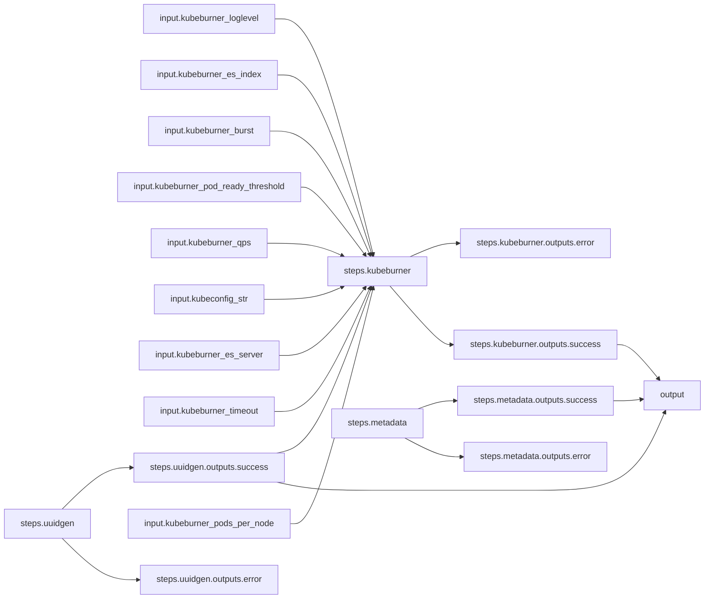

# Node-density-heavy Workflow

## Workflow Description

This example workflow runs a [kube-burner](https://github.com/cloud-bulldozer/kube-burner) node-density heavy workload plugin on the local system.

## Workflow Diagram
This diagram shows the complete end-to-end workflow logic.

