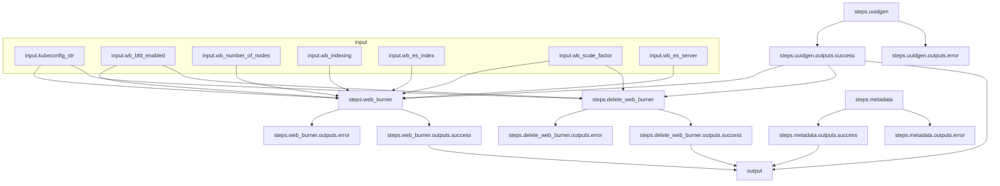

# Cluster-density Workflow

## Workflow Description

This example workflow runs a [web-burner](https://github.com/redhat-performance/web-burner) cluster-density workload plugin on the local baremetal cluster.

## Workflow Diagram
This diagram shows the complete end-to-end workflow logic.

