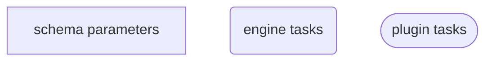
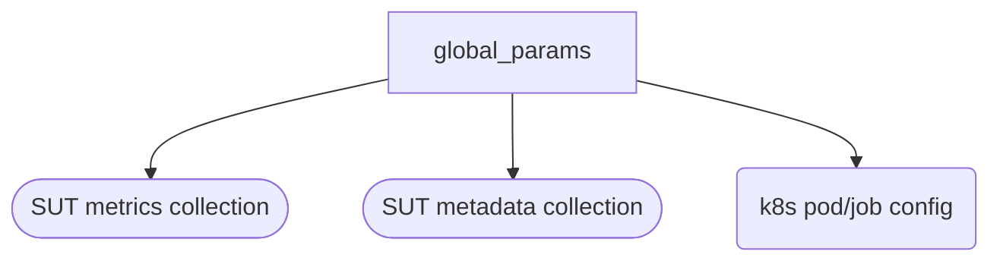
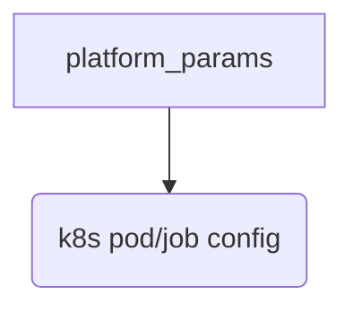
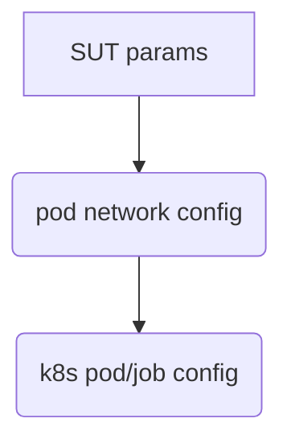
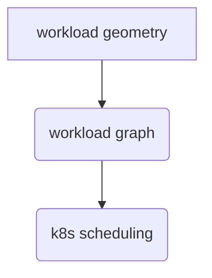
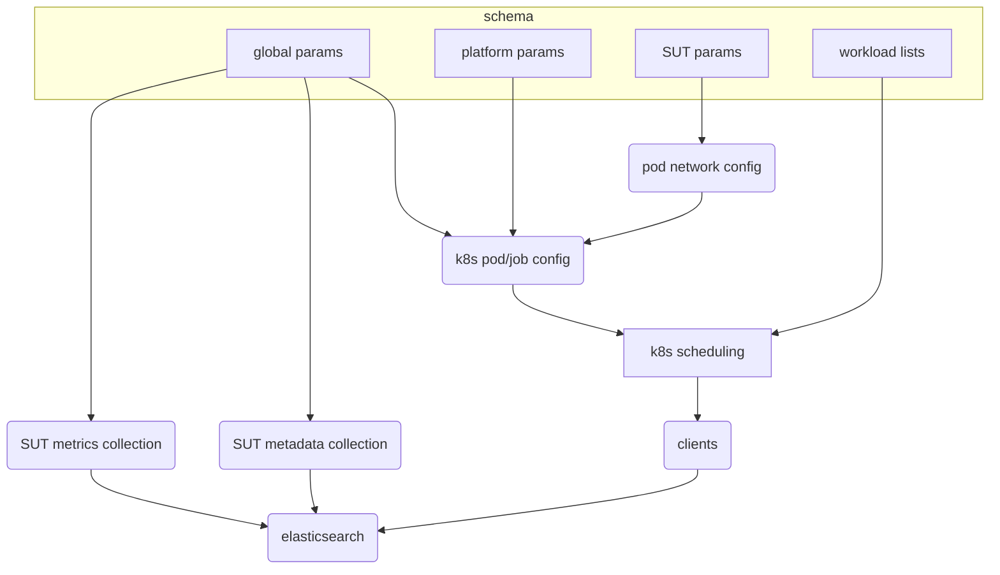

# Router Performance Workflow

## Workflow description

This workflow defines an end-to-end benchmark test for router performance, specifically using an ingress benchmark suite against a given Kubernetes cluster. 

A single top-level schema provides all of the data and metadata constructs required to describe the complete list of benchmark workloads to be run, as well as global and SUT (system under test) parameters
that further define the environment within which the test is run and how other parallel data collections will be handled. Finally, all data and metadata from the sequence
of tests are post-processed into an appropriate document format and indexed into Elasticsearch.

## Diagram Key


## Workflow and schema breakdown

Global parameters define metadata items that will persist throught the entire workflow, as well as flags for whether specific workload features, and therefore plugins, will be used.

```yaml
global_params:
    platform: enum
  	kubeconfig: str
  	es_server: str
    es_index: str
  	metadata_collection: bool
  	metadata_targeted: bool
  	system_metrics_collection: bool
  	uuid: str
   	cluster_name: str
    prom_url: str
  	prom_token: str
```



Platform params provide platform-specific authentication and resource values:

```yaml
platform_params:
  	auth_key1: str
  	auth_key2: str
  	resource_key1: str
  	resource_key2: str
```



SUT parameters affect kubernetes settings for pods and potentially other objects.

```yaml
sut_params:
    host_network: bool
        deployment_replicas: int
        node_selector: str
        service_type: str
        haproxy_image: str
        ingress_operator_image: str
```



The parameters for the router workloads should be available as defaults that will apply until overridden.

```yaml
router_workloads:
   	defaults:
        samples: int
        runtime: int
        terminations: string
        url_path: string
        keepalive_request: list[int]
        large_scale_threshold: int
        smale_scale_routes: int
        small_scale_clients: list[int]
        small_scale_clients_mix: list[int]
        large_scale_routes: int
        large_scale_clients: list[int]
        large_scale_clients_mix: list[int]
        tls_reuse: bool
        number_of_routers: int
        quiet_period: int
```

Individual workloads should be provided as lists of dicts, where parameters override the `defaults` above. Each list item should accept all parameters supported by the underlying schema.

```yaml
router_workloads:
  	workload: list[dict]
        - dict
        - dict 
        ...
```




## Complete workflow schema and diagram

```yaml
global_params:
    platform: enum
    kubeconfig: str
    es_server: str
    metadata_collection: bool
    metadata_targeted: bool
    system_metrics_collection: bool
    uuid: str
    cluster_name: str
    prom_token: str

sut_params:
    host_network: bool
    deployment_replicas: int
    node_selector: str
    service_type: str
    haproxy_image: str
    ingress_operator_image: str

router_workloads:
    defaults:
        samples: int
        runtime: int
        terminations: string
        url_path: string
        keepalive_request: list[int]
        large_scale_threshold: int
        smale_scale_routes: int
        small_scale_clients: list[int]
        small_scale_clients_mix: list[int]
        large_scale_routes: int
        large_scale_clients: list[int]
        large_scale_clients_mix: list[int]
        large_scale_clients_mix: list[int]
        tls_reuse: bool
        large_scale_clients_mix: list[int]
        number_of_routers: int
        quit_period: int
  	workload: list[dict]
        - dict
        - dict 
        ...		
```



	
